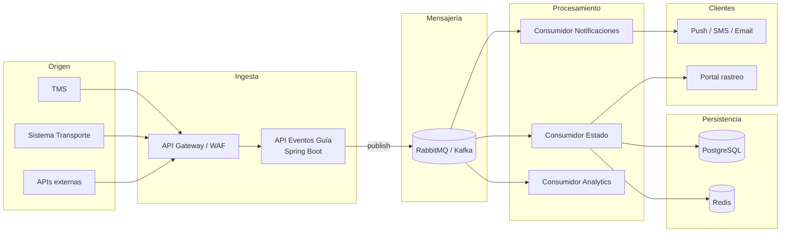

# Arquitectura — Eventos de Guía en Temporada Pico

Documento de apoyo para la sustentación (Eje 1: Arquitectura).

## Problema

En temporadas pico, el volumen de eventos de guías (estados, novedades, notificaciones) crece de forma abrupta. Se necesita capturar eventos sin pérdida, actualizar estado casi en tiempo real y notificar clientes, con un equipo pequeño que pueda evolucionar la solución con seguridad.

## Diseño propuesto



## Flujo de un evento

1. Sistema origen (TMS) envía `POST /api/v1/eventos/guia` con estado y `X-Idempotency-Key`.
2. API valida, enriquece metadata y publica en exchange `guia.eventos`.
3. Responde **202 Accepted** de inmediato (patrón *accept-then-process*).
4. Consumidores procesan en paralelo: actualizan BD, cache de rastreo y disparan notificaciones.
5. Reintentos con backoff exponencial; mensajes fallidos van a **DLQ** para revisión manual.

## Garantías clave

### No perder eventos

- Cola durable + mensajes persistentes.
- Confirmación de publicación (publisher confirms en RabbitMQ).
- Ack manual en consumidores (`ack` solo tras persistir en BD).
- Dead Letter Queue para fallos tras N reintentos.

### Idempotencia

- Header `X-Idempotency-Key` propagado al mensaje.
- Consumidor consulta store (Redis/PostgreSQL) antes de aplicar cambio.
- Clave compuesta alternativa: `numeroGuia + estado + fechaEvento`.

### Escalabilidad

- API stateless → escalado horizontal (K8s HPA por CPU/latencia).
- Cola desacopla picos de ingestión del procesamiento.
- Consumidores independientes escalan según lag de cola.
- Cache Redis para consultas de rastreo (lecturas frecuentes).

### Observabilidad

- Logs estructurados (JSON) con `eventoId`, `numeroGuia`, `traceId`.
- Métricas: tasa ingestión, lag de cola, latencia p95, tasa DLQ.
- Trazas distribuidas (OpenTelemetry → Grafana/Jaeger).
- Alertas: lag > umbral, DLQ > 0, error rate > 1%.

### Seguridad

- API Gateway con autenticación (JWT / mTLS entre sistemas internos).
- Rate limiting por cliente en gateway.
- Secrets en vault; sin credenciales en código.
- Datos sensibles en metadata enmascarados en logs.

## RabbitMQ vs Kafka

| Criterio | RabbitMQ | Kafka |
|----------|----------|-------|
| Complejidad operativa | Baja | Media-alta |
| Throughput extremo | Suficiente para mayoría de casos TCC | Superior en millones/min |
| Reprocesamiento histórico | Limitado (DLQ) | Nativo (retención por días) |
| Equipo pequeño | Más fácil de operar | Requiere más expertise |
| **Recomendación inicial** | **Sí** — MVP y validación | Migrar si métricas lo exigen |

## Camino a producción

1. **Semana 1-2**: MVP (este repo) + contrato OpenAPI + pruebas de carga básicas.
2. **Semana 3-4**: Consumidores de estado y notificaciones + idempotencia en Redis.
3. **Semana 5-6**: CI/CD (GitHub Actions), despliegue en K8s/EKS, observabilidad.
4. **Semana 7+**: Prueba de carga en staging, runbooks, capacitación al equipo.

### CI/CD mínimo

```
commit → build + tests → imagen Docker → deploy staging → smoke tests → deploy prod (manual approval)
```

## Qué incluye este repositorio (ejercicio previo)

Solo la **capa de ingesta**: API REST + publicación a RabbitMQ + pruebas + documentación. Es la base para extender con consumidores, idempotencia completa y despliegue en la sesión en vivo.
