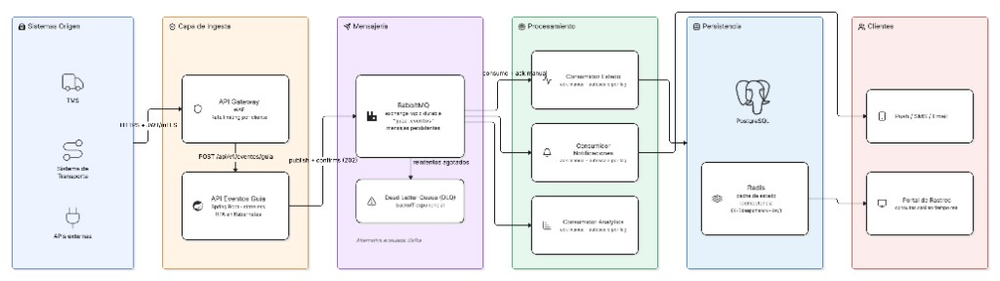

# Servicio de Eventos de Guía — Prueba Técnica TCC

API REST que recibe eventos de estado de guías y los publica en RabbitMQ para procesamiento asíncrono.

## Arquitectura

Solución de alta concurrencia para temporadas pico: la API de ingesta valida y publica cada evento en el broker, y responde de inmediato (`202 Accepted`). Los consumidores procesan en paralelo sin afectar la ingesta.



**Flujo de un evento:**

1. El sistema origen envía `POST /api/v1/eventos/guia` con el estado y un `X-Idempotency-Key` opcional.
2. La API valida, enriquece y publica en el exchange durable `guia.eventos` (mensajes persistentes).
3. Responde `202 Accepted` de inmediato (patrón *accept-then-process*).
4. Los consumidores actualizan BD/cache y disparan notificaciones; deduplican con la idempotency key.
5. Reintentos con backoff exponencial; los fallos persistentes van a DLQ.

Este repositorio implementa la **capa de ingesta** (API + publicación). El diseño completo — garantías de no pérdida, idempotencia, escalabilidad, observabilidad, seguridad y camino a producción — está en [ARQUITECTURA.md](ARQUITECTURA.md).

## Requisitos

- Docker (única dependencia para ejecutar todo)
- Java 17+ y Maven 3.8+ (solo para desarrollo local y tests)

## Ejecución rápida (todo en Docker)

```bash
# 1. Levantar RabbitMQ + API (compila dentro de la imagen, no requiere Java/Maven locales)
docker compose up -d --build

# 2. Enviar un evento de prueba
curl -X POST http://localhost:8080/api/v1/eventos/guia \
  -H "Content-Type: application/json" \
  -H "X-Idempotency-Key: idem-001" \
  -d '{
    "numeroGuia": "GUIA-123456",
    "estado": "EN_TRANSITO",
    "fechaEvento": "2026-07-23T15:30:00Z",
    "origen": "TMS",
    "metadata": { "ciudad": "Bogotá" }
  }'
```

Respuesta esperada (`202 Accepted`):

```json
{
  "eventoId": "uuid-generado",
  "numeroGuia": "GUIA-123456",
  "estado": "EN_TRANSITO",
  "publicadoEn": "2026-07-23T15:30:01Z",
  "mensaje": "Evento publicado correctamente"
}
```

Consola de RabbitMQ: http://localhost:15672 (guest / guest)

## Desarrollo local (sin Docker para la app)

```bash
docker compose up -d rabbitmq   # solo el broker
mvn spring-boot:run             # API con hot reload local
```

## Pruebas

```bash
mvn test           # pruebas unitarias y de slice web (5 tests)
./smoke-test.sh    # smoke tests end-to-end contra el entorno Docker levantado
```

## API

| Método | Ruta | Descripción |
|--------|------|-------------|
| POST | `/api/v1/eventos/guia` | Registra y publica un evento de estado |
| GET | `/actuator/health` | Health check |

## Variables de entorno

| Variable | Default | Descripción |
|----------|---------|-------------|
| `RABBITMQ_HOST` | localhost | Host de RabbitMQ |
| `RABBITMQ_PORT` | 5672 | Puerto AMQP |
| `RABBITMQ_USER` | guest | Usuario |
| `RABBITMQ_PASSWORD` | guest | Contraseña |

## Estructura del proyecto

```
src/main/java/com/tcc/eventos/
├── controller/     # REST API
├── service/        # Lógica de negocio
├── publisher/      # Publicación a cola (interfaz + RabbitMQ)
├── model/          # Evento de dominio
├── dto/            # Request/Response
└── config/         # Configuración RabbitMQ
Dockerfile          # Build multi-stage (Maven + JRE 17)
docker-compose.yml  # RabbitMQ + API con healthcheck
smoke-test.sh       # Pruebas end-to-end del entorno levantado
docs/               # Diagrama de arquitectura
```

## Decisiones técnicas

| Decisión | Ventaja | Desventaja |
|----------|---------|------------|
| **RabbitMQ** como cola | Simple, maduro, confirma entrega, equipo pequeño lo opera fácil | Menor throughput que Kafka en picos extremos |
| **HTTP 202 Accepted** | Responde rápido sin bloquear al cliente | El cliente debe consultar otro canal para confirmación final |
| **Interfaz `EventoGuiaPublisher`** | Permite cambiar broker (Kafka, SQS) sin tocar el servicio | Una capa extra (aceptable para evolución) |
| **Header `X-Idempotency-Key`** | Base para deduplicación en consumidores | Idempotencia completa requiere store (Redis/DB) en producción |
| **Docker multi-stage** | El evaluador solo necesita Docker; misma imagen para CI/CD | Build inicial más lento (mitigado con cache de capas) |
